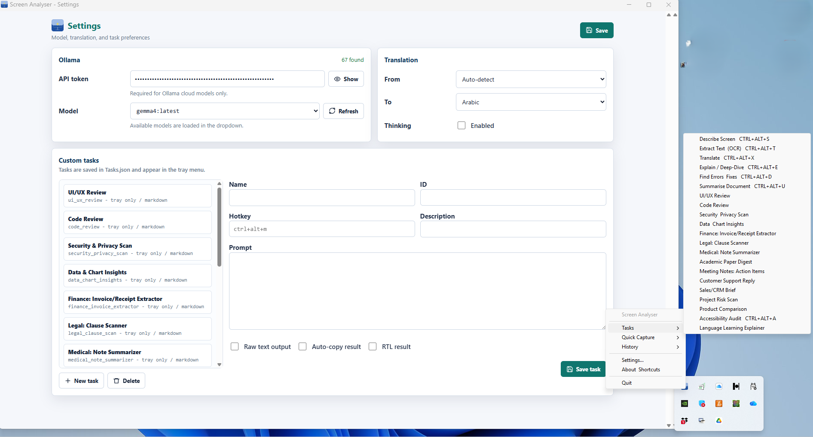

# Screen Analyser

Screen Analyser is a lightweight Windows tray application for capturing any
screen region and analysing it with Ollama vision models. It supports local
Ollama models, authenticated Ollama cloud models, browser-rendered results, RTL
translation output, and user-defined analysis tasks.



## Highlights

- Capture a selected screen region, the full screen, or a clipboard image.
- Run built-in tasks for description, OCR, translation, deep explanation,
  error finding, and document summarisation.
- Add custom tasks from Settings without changing code.
- Choose available Ollama models from a live dropdown list.
- Use local Ollama models or authenticated Ollama cloud models.
- View rich markdown and RTL text through the browser rendering engine.
- Save results as `.md` or `.txt`, and save screenshots as `.png`.
- Access the app from the Windows system tray with global hotkeys.

## What's New

Version 0.2 is a major stability and usability update focused on Windows device
compatibility, model selection, and UI quality.

- Replaced Tkinter result/settings/about screens with a browser-rendered app UI.
- Added a cleaner Settings page with separate Ollama, Translation, and Custom
  tasks panels.
- Replaced the model text field with a dropdown populated from detected local
  and authenticated cloud models.
- Added custom task persistence through `tasks.json`, with create/edit/delete
  support in Settings.
- Added a ready task pack with 15 custom tasks across different work domains.
- Fixed capture regressions where screenshots could appear to do nothing.
- Improved RTL output for Arabic, Hebrew, Persian, Urdu, and other RTL text.
- Reworked progress feedback into a small persistent popup while analysis runs.
- Fixed hotkey re-registration on devices where the `keyboard` package crashes
  inside `unhook_all_hotkeys()`.

## Built-In Tasks

| Task | Hotkey | Output |
| --- | --- | --- |
| Describe Screen | `Ctrl+Alt+S` | Markdown section cards |
| Extract Text (OCR) | `Ctrl+Alt+T` | Plain text, auto-copied |
| Translate | `Ctrl+Alt+X` | Plain text |
| Explain / Deep-Dive | `Ctrl+Alt+E` | Markdown section cards |
| Find Errors & Fixes | `Ctrl+Alt+D` | Markdown section cards |
| Summarise Document | `Ctrl+Alt+U` | Markdown section cards |
| Full Screen Capture | `Ctrl+Alt+F` | Markdown section cards |

## Ready Task Pack

The repository includes [tasks.json](tasks.json), a ready-to-use pack of 15
custom tasks. These tasks appear in the tray menu and can be edited from
Settings.

| Domain | Task |
| --- | --- |
| Product and design | UI/UX Review |
| Engineering | Code Review |
| Security | Security & Privacy Scan |
| Analytics | Data & Chart Insights |
| Finance | Finance: Invoice/Receipt Extractor |
| Legal | Legal: Clause Scanner |
| Healthcare | Medical: Note Summarizer |
| Research | Academic Paper Digest |
| Operations | Meeting Notes: Action Items |
| Support | Customer Support Reply |
| Sales | Sales/CRM Brief |
| Project management | Project Risk Scan |
| Purchasing | Product Comparison |
| Accessibility | Accessibility Audit |
| Education | Language Learning Explainer |

When running from source, the app reads `tasks.json` from the project root. When
running the compiled exe, place `tasks.json` next to `ScreenAnalyser.exe`.

## Requirements

- Windows 10 or Windows 11
- Python 3.10+ when running from source
- [Ollama](https://ollama.com) installed and running
- At least one vision-capable Ollama model, for example:

```bash
ollama pull qwen3-vl:4b
```

Cloud-only Ollama models can be used by adding an Ollama API token in Settings.

## Quick Start

### Run The Pre-Built App

Download `ScreenAnalyser.exe` from [Releases](../../releases), place
`tasks.json` next to it if you want the ready custom task pack, then run the exe.
Ollama must be running in the background for local models.

### Run From Source

```bash
git clone git@github.com:alihayajneh/ScreenAnalyser.git
cd ScreenAnalyser

python -m venv venv
venv\Scripts\activate

pip install -r requirements.txt
python screen_analyser.pyw
```

### Build The Exe

```bash
python -m PyInstaller screen_analyser.spec
```

The compiled application is written to:

```text
dist\ScreenAnalyser.exe
```

## Settings

Open Settings from the tray icon to configure:

- Ollama API token for authenticated cloud models.
- Active model, selected from the detected model dropdown.
- Translation source and target languages.
- Thinking mode for models that support reasoning-style output.
- Custom tasks, including name, prompt, hotkey, output mode, and auto-copy.

User settings are saved to `settings.json` next to the exe or project root.
Custom tasks are saved to `tasks.json`.

## Custom Tasks

Custom tasks are plain JSON objects. You can create them from Settings or edit
`tasks.json` directly.

```json
{
  "id": "my_task",
  "name": "My Task",
  "description": "What this task does",
  "hotkey": "ctrl+alt+m",
  "auto_copy": false,
  "raw_output": false,
  "rtl": false,
  "prompt": "Your prompt here..."
}
```

Task behavior:

- `hotkey`: optional global shortcut, such as `ctrl+alt+m`.
- `auto_copy`: copies the result to the clipboard when analysis completes.
- `raw_output`: shows plain text instead of markdown cards.
- `rtl`: displays the result with right-to-left layout.

Built-in tasks are defined in [app/tasks.py](app/tasks.py). Custom tasks do not
require code changes.

## Project Structure

```text
ScreenAnalyser/
|-- app/
|   |-- about.py             # About and shortcuts helpers
|   |-- browser_preview.py   # Browser preview support
|   |-- capture.py           # Screen/clipboard capture and Ollama worker
|   |-- config.py            # Path helpers and persistent settings
|   |-- history.py           # In-memory analysis history
|   |-- main.py              # App controller, queue dispatcher, hotkeys
|   |-- markdown_renderer.py # Legacy markdown renderer helpers
|   |-- ollama_utils.py      # Local/cloud Ollama discovery and routing
|   |-- result_window.py     # Result window facade
|   |-- rtl.py               # RTL shaping and bidi helpers
|   |-- selector.py          # Full-screen region selector
|   |-- settings_dialog.py   # Legacy settings dialog helpers
|   |-- state.py             # Shared queue and processing lock
|   |-- tasks.py             # Built-in tasks and custom task loader
|   |-- toast.py             # Toast and progress popup UI
|   |-- tray.py              # System tray icon and menus
|   `-- web_ui.py            # Browser-rendered app UI and API
|-- generate_icon.py         # Icon generation helper
|-- icon.ico                 # App icon
|-- README.md
|-- requirements.txt
|-- run.bat
|-- screen_analyser.pyw      # App launcher
|-- screen_analyser.spec     # PyInstaller build spec
|-- screenshot_1.png         # README screenshot
`-- tasks.json               # Ready custom task pack
```

## Troubleshooting

### No Models Are Listed

- Make sure Ollama is running.
- Confirm models are installed with `ollama list`.
- Pull a vision model with `ollama pull qwen3-vl:4b`.
- If using cloud models, add your Ollama API token in Settings and refresh the
  model list.

### Capture Does Not Start

- Check that another analysis is not already running.
- Restart the app from the tray menu.
- If global hotkeys are blocked by another program, use the tray menu actions.

### RTL Text Looks Wrong

- Use the browser-rendered result window, which applies browser text layout for
  RTL languages.
- For custom RTL tasks, enable the `rtl` flag in Settings.

## Dependencies

| Package | Purpose |
| --- | --- |
| `ollama` | Ollama Python client |
| `Pillow` | Screen capture and image processing |
| `pystray` | Windows system tray icon |
| `keyboard` | Global hotkeys |
| `pyinstaller` | Standalone exe build |

## License

MIT
